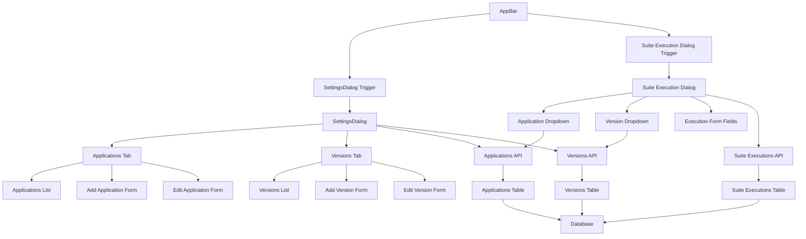

# Application/Version Management Component Structure



# Data Flow Diagram

```mermaid
sequenceDiagram
    participant User
    participant Dashboard
    participant SettingsDialog
    participant API
    participant Database
    
    User->>Dashboard: Click Settings
    Dashboard->>SettingsDialog: Open Dialog
    SettingsDialog->>API: GET /applications
    API->>Database: Query applications
    Database-->>API: Return applications
    API-->>SettingsDialog: Applications data
    SettingsDialog->>SettingsDialog: Display applications
    
    User->>SettingsDialog: Add new application
    SettingsDialog->>API: POST /applications
    API->>Database: Insert application
    Database-->>API: Success
    API-->>SettingsDialog: New application data
    SettingsDialog->>SettingsDialog: Update local state
    
    User->>Dashboard: Start Suite Execution
    Dashboard->>Dashboard: Check if apps/versions exist
    Dashboard->>API: GET /applications
    API->>Database: Query applications
    Database-->>API: Return applications
    API-->>Dashboard: Applications data
    Dashboard->>API: GET /versions
    API->>Database: Query versions
    Database-->>API: Return versions
    API-->>Dashboard: Versions data
    Dashboard->>Dashboard: Open Suite Execution Dialog
    Dashboard->>Dashboard: Populate dropdowns
    
    User->>Dashboard: Submit execution
    Dashboard->>API: POST /test-suites/{id}/start-execution
    API->>Database: Insert suite execution
    Database-->>API: Success
    API-->>Dashboard: Execution started