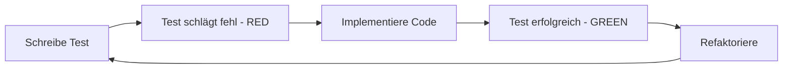

# Testframework-Implementierungsplan für TestSuite-Projekt

## Projektanalyse

### Aktuelle Architektur

- **Frontend**: React mit TypeScript und Material-UI
- **Backend**: Express.js mit TypeScript
- **Datenbank**: SQLite
- **Authentifizierung**: JWT-basiert
- **API**: RESTful mit CRUD-Operationen für Test Suites und Tests

### Identifizierte Testbereiche

1. **Server-seitig**: API-Endpunkte, Datenbankoperationen, Authentifizierung
1. **Client-seitig**: React-Komponenten, State Management, UI-Interaktionen
1. **Integration**: Client-Server-Kommunikation, End-to-End-Workflows

## Testframework-Architektur

### 1. Unit Tests

#### Server (Backend)

**Framework**: Jest + TypeScript

```json
{
  "devDependencies": {
    "@types/jest": "^29.5.0",
    "jest": "^29.5.0",
    "ts-jest": "^29.1.0",
    "@types/supertest": "^2.0.12",
    "supertest": "^6.3.3"
  }
}
```

**Teststruktur**:

```
server/
├── src/
│   ├── controllers/
│   │   └── __tests__/
│   │       ├── auth.controller.test.ts
│   │       ├── testSuite.controller.test.ts
│   │       └── test.controller.test.ts
│   ├── services/
│   │   └── __tests__/
│   │       ├── auth.service.test.ts
│   │       └── database.service.test.ts
│   ├── middleware/
│   │   └── __tests__/
│   │       └── auth.middleware.test.ts
│   └── utils/
│       └── __tests__/
│           └── validators.test.ts
```

#### Client (Frontend)

**Framework**: Jest + React Testing Library

```json
{
  "devDependencies": {
    "@testing-library/react": "^14.0.0",
    "@testing-library/jest-dom": "^6.1.0",
    "@testing-library/user-event": "^14.5.0",
    "jest-environment-jsdom": "^29.5.0"
  }
}
```

**Teststruktur**:

```
client/
├── src/
│   ├── components/
│   │   └── __tests__/
│   │       ├── TestSuiteList.test.tsx
│   │       ├── TestForm.test.tsx
│   │       └── LoginForm.test.tsx
│   ├── hooks/
│   │   └── __tests__/
│   │       └── useAuth.test.ts
│   └── utils/
│       └── __tests__/
│           └── api.test.ts
```

### 2. Integration Tests

**Framework**: Jest + Supertest (Server) / MSW (Mock Service Worker) für Client

```json
{
  "devDependencies": {
    "msw": "^2.0.0",
    "sqlite3": "^5.1.6",
    "@types/sqlite3": "^3.1.8"
  }
}
```

**Teststruktur**:

```
tests/
├── integration/
│   ├── api/
│   │   ├── auth.integration.test.ts
│   │   ├── testSuite.integration.test.ts
│   │   └── testExecution.integration.test.ts
│   ├── database/
│   │   └── migrations.integration.test.ts
│   └── fixtures/
│       ├── testData.ts
│       └── mockDatabase.ts
```

### 3. End-to-End Tests

**Framework**: Playwright

```json
{
  "devDependencies": {
    "@playwright/test": "^1.40.0",
    "playwright": "^1.40.0"
  }
}
```

**Teststruktur**:

```
e2e/
├── tests/
│   ├── auth.e2e.spec.ts
│   ├── testSuiteManagement.e2e.spec.ts
│   ├── testExecution.e2e.spec.ts
│   └── exportFunctionality.e2e.spec.ts
├── fixtures/
│   ├── testEnvironment.ts
│   └── pageObjects/
│       ├── loginPage.ts
│       ├── dashboardPage.ts
│       └── testSuitePage.ts
└── playwright.config.ts
```

## Konfigurationsdateien

### 1. Jest-Konfiguration (jest.config.js)

```javascript
module.exports = {
  preset: 'ts-jest',
  testEnvironment: 'node',
  roots: ['<rootDir>/src', '<rootDir>/tests'],
  testMatch: ['**/__tests__/**/*.ts', '**/*.test.ts'],
  collectCoverageFrom: [
    'src/**/*.{ts,tsx}',
    '!src/**/*.d.ts',
    '!src/**/index.ts'
  ],
  coverageThreshold: {
    global: {
      branches: 80,
      functions: 80,
      lines: 80,
      statements: 80
    }
  },
  setupFilesAfterEnv: ['<rootDir>/tests/setup.ts']
};
```

### 2. Playwright-Konfiguration (playwright.config.ts)

```typescript
import { defineConfig, devices } from '@playwright/test';

export default defineConfig({
  testDir: './e2e/tests',
  fullyParallel: true,
  forbidOnly: !!process.env.CI,
  retries: process.env.CI ? 2 : 0,
  workers: process.env.CI ? 1 : undefined,
  reporter: 'html',
  use: {
    baseURL: 'http://localhost:3000',
    trace: 'on-first-retry',
  },
  projects: [
    {
      name: 'chromium',
      use: { ...devices['Desktop Chrome'] },
    },
    {
      name: 'firefox',
      use: { ...devices['Desktop Firefox'] },
    },
  ],
  webServer: {
    command: 'npm run dev',
    url: 'http://localhost:3000',
    reuseExistingServer: !process.env.CI,
  },
});
```

## Claude Code Integration

### Test-Generierung mit Claude Code

#### 1. Befehle für Unit Tests

```bash
# Server Unit Tests generieren
claude-code generate-tests --type unit --target server/src/controllers/auth.controller.ts

# Client Unit Tests generieren
claude-code generate-tests --type unit --target client/src/components/TestSuiteList.tsx
```

#### 2. Befehle für Integration Tests

```bash
# API Integration Tests
claude-code generate-tests --type integration --api-spec swagger.json

# Database Integration Tests
claude-code generate-tests --type integration --database schema.sql
```

#### 3. Befehle für E2E Tests

```bash
# E2E Test aus User Story generieren
claude-code generate-e2e --story "Als Benutzer möchte ich mich einloggen und eine Test Suite erstellen"
```

### Claude Code Templates

#### Unit Test Template

```typescript
// claude-templates/unit-test.template.ts
describe('{{componentName}}', () => {
  beforeEach(() => {
    // Setup
  });

  it('should {{testDescription}}', () => {
    // Arrange
    // Act
    // Assert
  });
});
```

#### Integration Test Template

```typescript
// claude-templates/integration-test.template.ts
describe('{{apiEndpoint}} Integration', () => {
  let app: Application;
  let db: Database;

  beforeAll(async () => {
    // Initialize test database
    // Start server
  });

  afterAll(async () => {
    // Cleanup
  });

  it('should {{testScenario}}', async () => {
    // Test implementation
  });
});
```

## TDD-Workflow

### 1. Red-Green-Refactor Zyklus



### 2. TDD-Prozess mit Claude Code

1. **Test First**: Claude Code generiert Tests basierend auf Anforderungen
1. **Implementation**: Entwickler implementiert minimalen Code
1. **Verification**: Automatische Test-Ausführung
1. **Refactoring**: Code-Optimierung mit grünen Tests

### 3. Continuous Testing Pipeline

```yaml
# .github/workflows/test.yml
name: Test Pipeline
on: [push, pull_request]
jobs:
  test:
    runs-on: ubuntu-latest
    steps:
      - uses: actions/checkout@v3
      - uses: actions/setup-node@v3
      - run: npm ci
      - run: npm run test:unit
      - run: npm run test:integration
      - run: npm run test:e2e
      - run: npm run test:coverage
```

## Implementierungs-Roadmap

### Phase 1: Setup (Woche 1)

- [ ] Jest und Testing Libraries installieren
- [ ] Basis-Konfigurationen erstellen
- [ ] Test-Ordnerstruktur anlegen
- [ ] CI/CD Pipeline konfigurieren

### Phase 2: Unit Tests (Woche 2-3)

- [ ] Server Controller Tests
- [ ] Service Layer Tests
- [ ] React Component Tests
- [ ] Utility Function Tests
- [ ] Coverage-Ziel: 80%

### Phase 3: Integration Tests (Woche 4)

- [ ] API Endpoint Tests
- [ ] Database Operation Tests
- [ ] Authentication Flow Tests
- [ ] Error Handling Tests

### Phase 4: E2E Tests (Woche 5)

- [ ] User Journey Tests
- [ ] Critical Path Tests
- [ ] Cross-Browser Tests
- [ ] Performance Tests

### Phase 5: Claude Code Integration (Woche 6)

- [ ] Template-Erstellung
- [ ] Automatisierungs-Scripts
- [ ] Dokumentation
- [ ] Team-Training

## Best Practices

### 1. Test-Namenskonventionen

- Unit Tests: `[ComponentName].test.ts`
- Integration Tests: `[Feature].integration.test.ts`
- E2E Tests: `[UserJourney].e2e.spec.ts`

### 2. Test-Daten-Management

```typescript
// tests/fixtures/testDataFactory.ts
export const createTestSuite = (overrides = {}) => ({
  id: faker.datatype.uuid(),
  name: faker.lorem.words(3),
  description: faker.lorem.sentence(),
  createdAt: faker.date.past(),
  ...overrides
});
```

### 3. Mocking-Strategien

- **Unit Tests**: Vollständiges Mocking aller Dependencies
- **Integration Tests**: Teilweises Mocking (externe Services)
- **E2E Tests**: Kein Mocking (reale Umgebung)

### 4. Test-Isolation

```typescript
beforeEach(async () => {
  await db.clean();
  await db.seed();
});

afterEach(async () => {
  jest.clearAllMocks();
});
```

## Wartbarkeit

### 1. Page Object Pattern (E2E)

```typescript
// e2e/pageObjects/basePage.ts
export class BasePage {
  constructor(protected page: Page) {}
  
  async navigateTo(path: string) {
    await this.page.goto(path);
  }
}
```

### 2. Test Helpers

```typescript
// tests/helpers/apiHelper.ts
export const authenticatedRequest = async (endpoint: string, options = {}) => {
  const token = await getAuthToken();
  return request(app)
    .get(endpoint)
    .set('Authorization', `Bearer ${token}`)
    ...options;
};
```

### 3. Shared Test Utilities

```typescript
// tests/utils/testUtils.ts
export const waitForCondition = async (
  condition: () => boolean,
  timeout = 5000
) => {
  // Implementation
};
```

## Metriken und Reporting

### 1. Coverage-Ziele

- Unit Tests: 85% Coverage
- Integration Tests: 70% Coverage
- E2E Tests: Kritische User Journeys

### 2. Test-Reporting

```json
{
  "scripts": {
    "test:report": "jest --coverage --coverageReporters=html",
    "test:ci": "jest --ci --coverage --coverageReporters=lcov",
    "test:watch": "jest --watch"
  }
}
```

### 3. Performance-Metriken

- Unit Tests: < 10 Sekunden
- Integration Tests: < 1 Minute
- E2E Tests: < 5 Minuten

## Dokumentation

### 1. Test-Dokumentation

```typescript
/**
 * @test TestSuite Creation
 * @description Verifies that a new test suite can be created with valid data
 * @requirement TS-001
 */
it('should create a new test suite successfully', async () => {
  // Test implementation
});
```

### 2. README für Tests

```markdown
# Test Suite

## Ausführung
- `npm run test` - Alle Tests
- `npm run test:unit` - Unit Tests
- `npm run test:integration` - Integration Tests
- `npm run test:e2e` - E2E Tests

## Struktur
...
```

## Zusammenfassung

Dieser Plan bietet eine vollständige Test-Strategie für das TestSuite-Projekt mit:

- **Klarer Trennung** zwischen Unit-, Integration- und E2E-Tests
- **Claude Code Integration** für automatisierte Test-Generierung
- **TDD-fokussiertem** Entwicklungsprozess
- **Hoher Wartbarkeit** durch strukturierte Organisation
- **CI/CD-Integration** für kontinuierliche Qualitätssicherung

Die Implementierung erfolgt in 6 Phasen über 6 Wochen, wobei jede Phase aufeinander aufbaut und das Team schrittweise in die TDD-Praktiken einführt.
